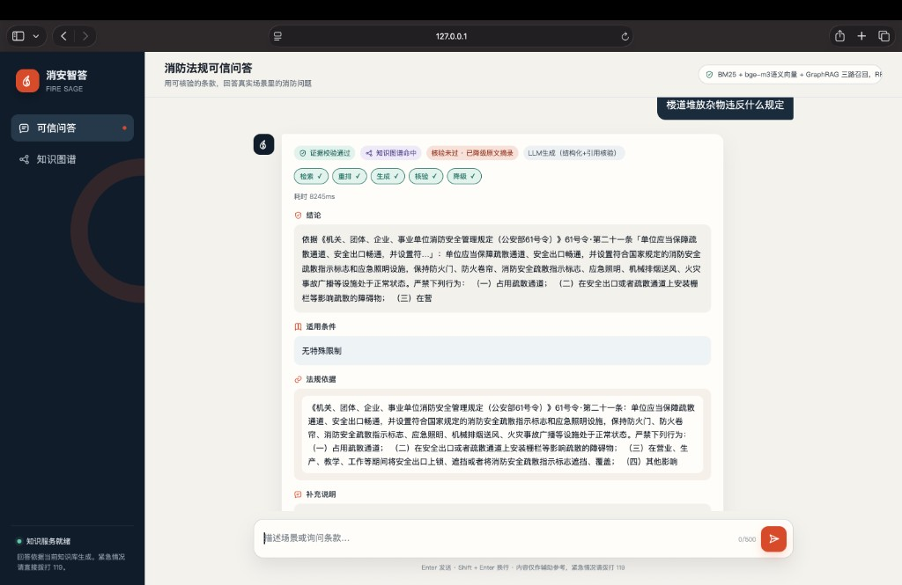
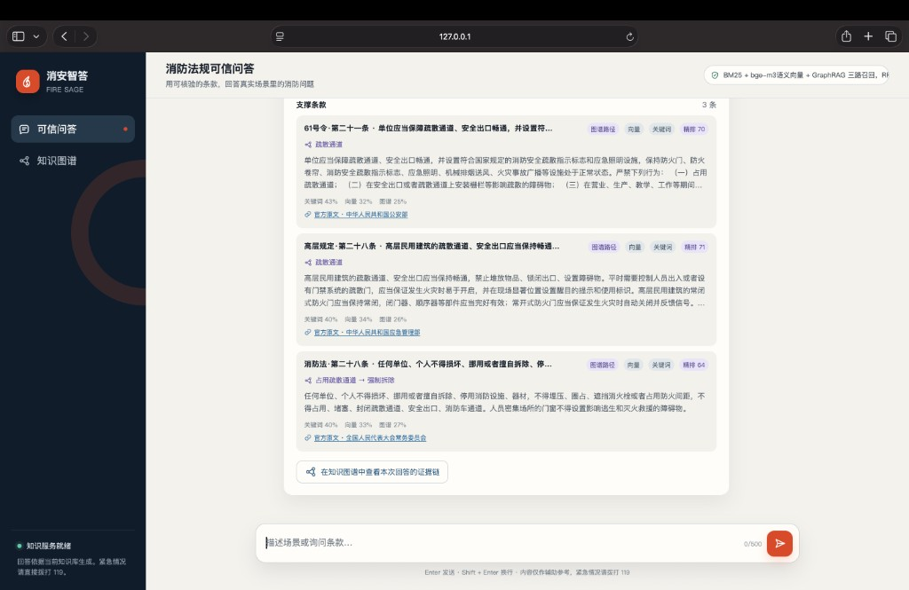
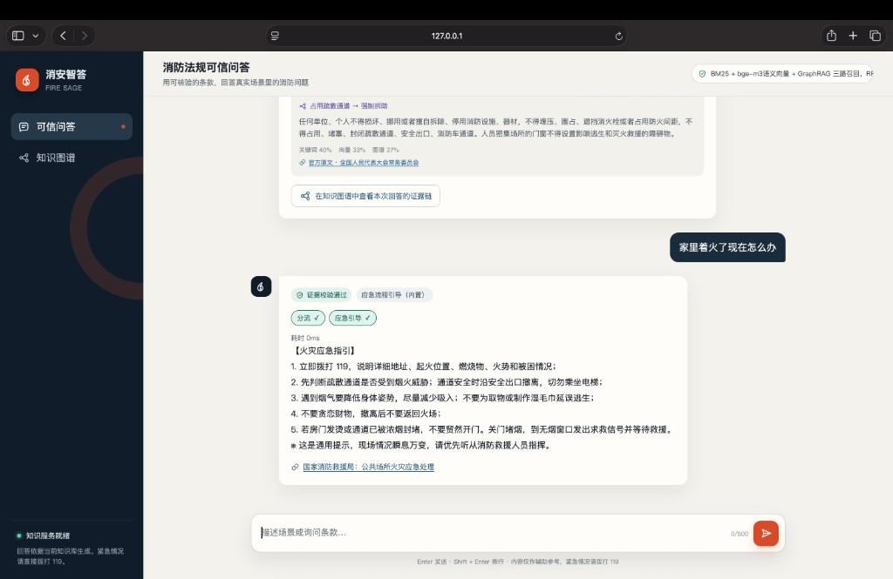
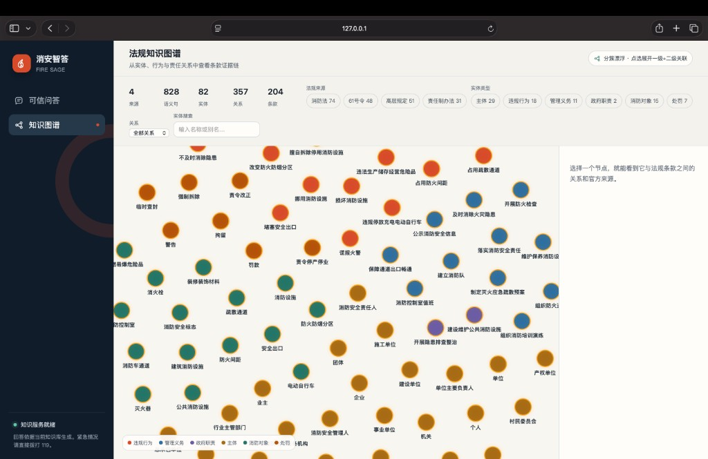
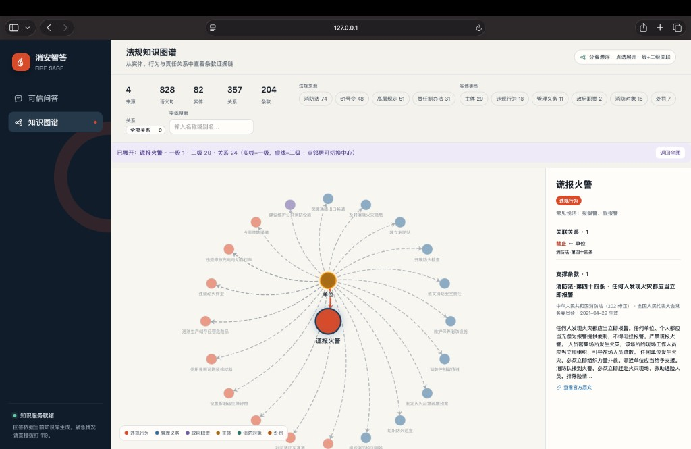
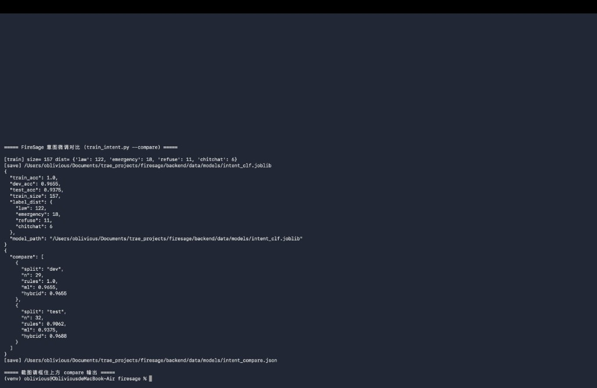

# 消安智答 解决方案

**智慧消防应急可信问答｜面向行业落地的技术方案说明**

| 项 | 内容 |
|----|------|
| 产品名称 | 消安智答 |
| 定位 | 消防法规咨询与火灾应急提示的可信智能问答系统 |
| 技术路线 | 大模型领域微调 + 检索增强生成（RAG）融合 |
| 当前形态 | 可演示、可评测的 Web 原型 |
| 演示地址 | http://127.0.0.1:8319 |
| 代码仓库 | https://github.com/qstk423/firesage |
| 文档版本 | v4.1（含实机演示截图） |

---

## 一、我们要解决什么问题

消防合规与应急场景里，基层人员（物业、单位安全员、网格员、值班员）每天都会碰到两类问题：

1. **日常咨询**：楼道能不能堆物、占用通道怎么处理、设施维保谁负责、罚多少——需要快速对上可溯源的法规条款。  
2. **突发火情**：家里或现场着火了怎么办——需要立刻给出正确处置路径，而不是去搜罚则。

现有通用大模型直接作答，在这个场景里风险很高：容易编造条款、套错责任主体、把「隐患整改」和「真火情」混为一谈。传统法规检索又要求用户会说法言法语，基层用不起来。

**客户真正要的不是「会聊天」，而是「答得对、说得出处、答不了就承认」。**

因此本方案的原则是：

> **法规事实来自检索，不靠模型背条文；证据不足则拒答，不编造。**

---

## 二、方案逻辑（为什么这样设计）

面向科大讯飞所关注的「大模型微调 + 检索增强融合」方向，我们把系统拆成四层，逻辑闭环如下：

| 层次 | 做什么 | 解决什么 |
|------|--------|----------|
| 意图分流 | 先判断：法规咨询 / 真火情应急 / 拒答 / 闲聊 | 防止应急与咨询路径串台 |
| 混合检索 | 关键词 + 语义向量 + 知识图谱三路召回，再融合精排 | 口语也能命中正确条款 |
| 约束生成 | 只依据检索到的条款组织答案；失败则摘录原文 | 结论绑定证据 |
| 可信核验 | 引用是否在依据内、置信是否足够；不够就拒答 | 高风险场景可交代 |

**微调落点说明（对企业诚实、也对命题对齐）：**  
本阶段已完成**意图路由领域微调**（决定走哪条业务路径），并与规则策略组成混合路由，可复现对比。  
已具备**条款重排微调**实验与开关，以及**生成式监督微调（SFT）数据**（问题+给定条款→结构化答案）。  
生成侧线上仍为「检索约束下的大模型调用 + 抽取式降级」；**LoRA 权重训练**可在 GPU/云端用现成 JSONL 继续完成。

这样安排的业务原因：在消防场景，**分错意图比答得不够漂亮更危险**，所以优先把分流做稳、做可测。

---

## 三、产品能提供什么（已实现能力）

### 3.1 对终端用户

| 能力 | 说明 | 业务价值 |
|------|------|----------|
| 口语法规问答 | 自然语言提问，输出结论、适用条件、法规依据、补充说明与置信度 | 降低检索门槛 |
| 条款可溯源 | 展示支撑条款、检索路径，并提供官方原文链接 | 便于核对与留痕 |
| 火灾应急分流 | 识别真火情后给出一百一十九应急指引，不进入罚则检索 | 保障处置路径正确 |
| 证据不足拒答 | 知识库未覆盖或检索置信低时明确拒答 | 控制误导风险 |
| 要素澄清 | 关键要素不明（如通道类型、责任主体）时先问清再答 | 减少套错条款 |
| 知识图谱 | 分簇总览；点选展开一级、二级关系与支撑条款 | 把「依据」讲清楚 |
| 回答跳转证据链 | 从本次回答进入局部证据子图 | 咨询过程可解释 |

### 3.2 对系统侧（可交付技术能力）

| 能力 | 状态 | 说明 |
|------|------|------|
| 意图路由（规则 + 微调混合） | 已具备 | 默认混合策略；测试集混合准确率约 0.969 |
| 条款重排微调 | 已具备（可选） | `train_rerank.py`；默认关闭，`RERANK_ML=1` 启用 |
| 生成式 SFT 数据 | 已具备 | FireEval → `data/models/sft/gen_sft_*.jsonl`，供 LoRA |
| 生成式 LoRA 训练 | 可接 GPU/云端 | `train_gen_lora.py`（无训练依赖时 dry-run） |
| 场景结构化与查询改写 | 已具备 | 口语映射到法规行为与对象 |
| 关键词检索 | 已具备 | 精确命中法言表述 |
| 语义向量检索 | 已具备（可降级） | 承接口语与同义表达 |
| 知识图谱检索 | 已具备 | 约 82 实体、357 关系 |
| 多路融合与精排 | 已具备（精排可降级） | 保证主链路可运行 |
| 结构化生成 | 已具备（可降级） | 大模型可用时结构化输出，否则原文摘录 |
| 引用核验与低置信拒答 | 已具备 | 可信闭环 |
| 生成式大模型全量微调 | 规划中 | 下一阶段在云端完成 LoRA 权重 |

### 3.3 知识与评测基础

| 资产 | 内容 |
|------|------|
| 法规来源 | 《消防法》《公安部 61 号令》《高层民用建筑消防安全管理规定》《消防安全责任制实施办法》 |
| 规模 | 约 204 条款、828 语义句、82 图谱实体、357 关系 |
| 评测集 | 200 题人工核验，含 train / dev / test 划分 |
| 复现实验 | 意图微调对比、检索消融脚本可复跑 |

---

## 四、系统架构与处理流程

### 4.1 架构概览

```text
Web 前端：可信问答 · 法规知识图谱
                │
         业务编排（Pipeline）
  意图路由 → 场景结构化 → 查询改写 → 检索 → 生成 → 核验
      │           │            │          │
  意图微调分类器  混合检索     知识图谱    引用核验
               关键词+向量+图谱
                │
         官方法规语料与元数据
```

### 4.2 一次提问怎么走完

```text
用户提问
  → 意图路由：法规 / 应急 / 拒答 / 闲聊
  →（法规路径）场景结构化、同义扩展
  → 关键词 + 语义向量 + 知识图谱三路召回
  → 多路融合、法规意图重排、精排
  → 基于条款结构化作答（失败则摘录原文）
  → 引用核验；不足则拒答或降级
  →（应急路径）直接输出一百一十九指引
```

### 4.3 工程上如何保证能演示、能对接

向量模型、精排模型或大模型暂时不可用时，系统自动降级（例如加强关键词检索、改为条款摘录），**主流程不中断**。  
这对企业试点很重要：现场环境未必一次配齐全部模型服务，但业务演示与联调仍可继续。

---

## 五、效果与验证（用数据说话）

### 5.1 意图分流对比（测试集）

| 方法 | 准确率 |
|------|--------|
| 仅规则 | 0.906 |
| 仅微调分类器 | 0.938 |
| 规则 + 微调混合（默认） | **0.969** |

结论：在真实分流任务上，混合策略优于纯规则，说明领域微调带来可复用收益。

### 5.2 问答与检索（开发集，降级环境基线）

| 指标 | 数值 | 含义 |
|------|------|------|
| 路由准确率 | 1.00 | 意图分流正确率 |
| Hit@1 | **0.87**（dev）/ **0.92**（test） | 首条依据命中目标条款 |
| Hit@3 | **1.00** | 前三条命中 |
| MRR | 0.92（dev）/ 0.94（test） | 平均倒数排名 |
| 必须结论准确率 | 1.00 | must_conclusions |
| 引用准确率 | 1.00 | 回答引用落在检索依据内 |
| 拒答准确率 | 1.00 | 该拒则拒、不该拒则答 |
| 严重错误率 | 0.00 | 禁止出现的错误结论未出现 |

说明：以上为本地降级环境（向量/精排/大模型不可用）基线。完整模型链路可用时通常不低于此水平。dev/test 的 Hit@1 均已超过内部 0.85 门槛。

复现命令：

```bash
python3 backend/scripts/train_intent.py --compare
python3 backend/scripts/evaluate_fireeval.py --split dev
```

---

## 六、系统演示（实机截图）

以下截图均来自本机运行实机界面，对应业务对接时的标准演示路径。

### 6.1 口语法规问答

提问：「楼道堆放杂物违反什么规定」。系统给出结构化结论，并绑定可核验条款依据。



### 6.2 条款溯源与检索路径

支撑条款卡片展示关键词 / 向量 / 图谱贡献占比、精排分数与官方原文链接，便于核对。



### 6.3 火灾应急分流

提问：「家里着火了现在怎么办」。系统识别为真火情，输出一百一十九应急指引，不进入罚则检索。



### 6.4 知识图谱总览

按实体类型分簇展示，默认不拉全图连线，便于先看清结构规模。



### 6.5 点选展开一级 / 二级关系

以「谎报火警」为例：一级关系实线、二级关联虚线，右侧展示支撑条款与官方来源。



### 6.6 意图微调对比实验

运行意图对比脚本后，测试集上混合路由准确率约 0.969，高于纯规则 0.906。



---


## 七、边界、现状与合作节奏

### 7.1 当前适合什么

- 作为**垂直场景样板**：演示「微调 + 检索增强 + 可信核验」如何落在消防问答。  
- 作为**联调与方案讨论底座**：接口清晰，可按企业模型与语料条件替换组件。  
- 作为**评测先行的试点**：已有题目集与指标，便于双方共同定验收口径。

### 7.2 当前不承诺什么

- 不替代执法解释、专业法律意见或现场消防指挥。  
- 不是覆盖全国地方规章、预案、设备手册的全库平台。  
- 不是多租户运营后台或指挥调度系统。  
- 生成侧全量 / 参数高效微调尚未完成，不写成「已完成全链路大模型微调」。

### 7.3 建议的下一阶段（可合作推进）

| 优先级 | 事项 | 目的 |
|--------|------|------|
| 高 | 生成侧忠实微调（给定条款内作答） | 补齐命题中的生成微调闭环 |
| 高 | 重排 / 条款匹配增强，提升 Hit@1 | 提高首条依据命中率 |
| 中 | 按试点单位扩展地方规章与高频场景语料 | 贴近真实业务覆盖 |
| 中 | 按对接要求适配企业侧大模型与向量服务 | 纳入现有技术栈 |
| 低 | 权限、审计、运维等产品化能力 | 进入正式试点后再做 |

---

## 八、一句话总结

消安智答把消防场景拆成「先分对路径，再检索到依据，再约束作答，最后核验或拒答」的业务闭环，用可演示原型证明：在高风险问答里，**大模型微调与检索增强可以融合落地，并且经得起核对。**

我们期待以此为样板，与命题方就模型服务对接、语料扩展与验收指标进一步沟通。

---

## 附录：本地启动

```bash
git clone https://github.com/qstk423/firesage.git
cd firesage
python3 -m venv venv && source venv/bin/activate
pip install -r requirements.txt
cd backend && python3 main.py
# 浏览器打开 http://127.0.0.1:8319
```

---

*本文件描述的是可演示技术方案与已完成能力。法规文本以官方发布为准；系统输出仅供辅助参考。紧急情况请拨打 119。*
